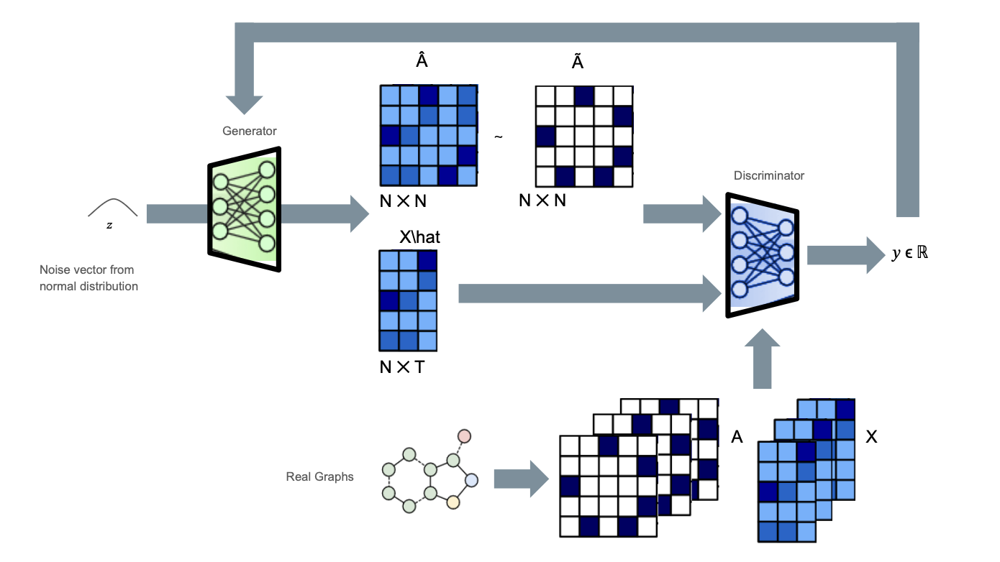
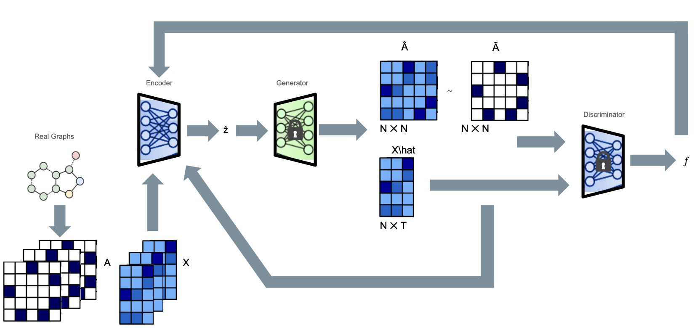

# gladGAN
Graph anomaly detection (GAD) via generative adversarial networks (GANs).

## Pipelines

<div align="center">
  
  <p><em>WGAN training pipeline.<p></em>
</div>

<div align="center">
  
  <p><em>Encoder training pipeline.<p></em>
</div>

## Run

### Conda

```
$ conda env create -f environment.yml
```
And then to activate the environment:
```
$ conda activate gadan
```
